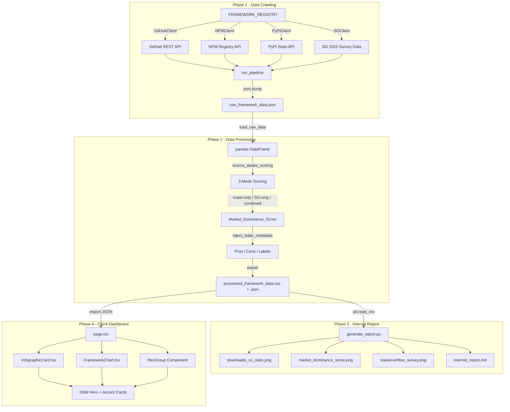

# Framework Trends Tracker & Reporting System

> Automated data pipeline that crawls, scores, and visualizes frontend & backend framework popularity across GitHub, NPM, PyPI, and Stack Overflow Developer Survey 2025.

---

## Overview

This system extracts real-time popularity metrics for **18 target frameworks** and produces three deliverables:

| Output | Audience | Format |
|--------|----------|--------|
| **Sumber Data** | Data engineers | Raw JSON + Processed CSV/JSON |
| **Visualisasi + Teks** | Engineering leads | Markdown report + Plotly charts |
| **Visualisasi Tanpa Teks** | Stakeholders | Standalone chart PNGs + Next.js dashboard |

**Target Frameworks (18):**
- **Frontend (8):** Vue.js, React, Next.js, Angular, Svelte, Nuxt, Astro, Remix
- **Backend (10):** FastAPI, Express.js, Spring Boot, Django, Flask, NestJS, Laravel, Ruby on Rails, Phoenix, ASP.NET Core

---

## Architecture Flow



---

## Tech Stack

### Data Pipeline (Python)

| Layer | Technology | Purpose |
|-------|-----------|---------|
| HTTP Requests | `requests` | REST API calls to GitHub, NPM, PyPI |
| Data Processing | `pandas` | Source-aware normalization, scoring, CSV/JSON export |
| Visualization | `plotly` + `kaleido` | Chart generation and static PNG export |
| Runtime | Python 3.10+ | Pipeline execution environment |

### Client Dashboard (Next.js)

| Layer | Technology | Purpose |
|-------|-----------|---------|
| Framework | Next.js 16 (App Router) | Static generation, TypeScript |
| Language | TypeScript | Type-safe component development |
| Styling | Tailwind CSS | Utility-first responsive design |
| Visualization | Pure CSS + animations | Progress bars, orbit rings, no chart libraries |

### Data Exchange

| Format | Consumer | Location |
|--------|----------|----------|
| JSON (raw) | Python pipeline | `data/raw/` |
| CSV (processed) | Internal report generator | `data/processed/` |
| JSON (processed) | Next.js dashboard | `data/processed/` → `client_dashboard/src/data/` |

---

## Project Structure

```
framework-trends-tracker/
├── scraper/
│   ├── __init__.py
│   ├── api_clients.py              # GitHubClient, NPMClient, PyPIClient + FRAMEWORK_REGISTRY (18 frameworks)
│   ├── stackoverflow_client.py     # SO 2025 survey data for all 18 frameworks
│   ├── data_processor.py           # Source-aware scoring (3 modes), static metadata, export
│   └── main_pipeline.py            # run_pipeline orchestrator with --sources CLI flag
├── data/
│   ├── raw/
│   │   └── raw_framework_data.json
│   └── processed/
│       ├── processed_framework_data.csv
│       └── processed_framework_data.json
├── reports_internal/
│   ├── __init__.py
│   ├── generate_report.py          # 3 Plotly charts + architecture comparison + markdown report
│   └── output/
│       ├── charts/
│       │   ├── downloads_vs_stars.png
│       │   ├── market_dominance_score.png
│       │   └── stackoverflow_survey.png
│       └── internal_report.md
├── run_pipeline.bat                # One-click pipeline runner
├── requirements.txt
└── README.md

client_dashboard/
├── src/
│   ├── app/
│   │   ├── globals.css             # Orbit animation keyframes, accent color variables
│   │   ├── layout.tsx              # Root layout with Geist fonts
│   │   └── page.tsx                # Full-screen hero with orbit icons + tiered recommendations
│   ├── components/
│   │   ├── InfographicCard.tsx     # Framework metric card with accent-colored progress bars
│   │   └── FrameworkChart.tsx      # CSS horizontal ranking bars grouped by category
│   └── data/
│       └── processed_framework_data.json
├── public/
│   └── icons/                      # Framework icon assets (react, vue, angular, django, laravel, golang)
├── package.json
├── tsconfig.json
└── next.config.ts
```

---

## Prerequisites

| Requirement | Version | Notes |
|-------------|---------|-------|
| Python | 3.10+ | `python --version` to verify |
| Node.js | 18+ | `node --version` to verify |
| npm | 9+ | Bundled with Node.js |

---

## Installation

### 1. Python Dependencies

```bash
cd framework-trends-tracker
pip install -r requirements.txt
```

### 2. Next.js Dependencies

```bash
cd client_dashboard
npm install
```

---

## Usage

### Run the Full Python Pipeline

```bash
cd framework-trends-tracker
run_pipeline.bat
```

Or run with specific data sources using the `--sources` flag:

```bash
# All sources combined (default)
python -m scraper.main_pipeline

# GitHub + NPM/PyPI only (crawl-only scoring)
python -m scraper.main_pipeline --sources github npm pypi

# Stack Overflow only (SO-only scoring)
python -m scraper.main_pipeline --sources stackoverflow

# GitHub + Stack Overflow
python -m scraper.main_pipeline --sources github stackoverflow
```

**Available sources:** `github`, `npm`, `pypi`, `stackoverflow`

### Start the Client Dashboard

```bash
npm run dev --prefix client_dashboard
```

Open [http://localhost:3000](http://localhost:3000) in your browser.

### Build for Production

```bash
npm run build --prefix client_dashboard
npm run start --prefix client_dashboard
```

---

## Scoring Methodology

The **Market Dominance Score** uses **source-aware scoring** with 3 modes depending on available data:

### Mode 1: Crawl-Only (GitHub + NPM/PyPI, no SO data)

```
Score = (norm_stars × 0.4) + (norm_downloads × 0.6)
```

### Mode 2: SO-Only (Stack Overflow data, no crawl data)

```
Score = (norm_usage × 0.5) + (norm_admired × 0.3) + (norm_desired × 0.2)
```

### Mode 3: Combined (All sources)

```
Score = (norm_stars × 0.2) + (norm_downloads × 0.3) + (norm_usage × 0.3) + (norm_admired × 0.1) + (norm_desired × 0.1)
```

| Component | Source | Weight (Combined) | Rationale |
|-----------|--------|-------------------|-----------|
| `norm_stargazers_count` | GitHub | 20% | Community interest |
| `norm_total_weekly_downloads` | NPM / PyPI | 30% | Actual production adoption |
| `norm_so_usage` | SO Survey 2025 | 30% | Industry-wide usage signal (23,678 respondents) |
| `norm_so_admired` | SO Survey 2025 | 10% | Developer satisfaction |
| `norm_so_desired` | SO Survey 2025 | 10% | Growth potential |

Normalization uses **min-max scaling** across all 18 frameworks:

```
norm_value = (value - min) / (max - min)
```

---

## Dashboard Features

### Hero Section
- Full-viewport (`100vh`) hero with **orbiting framework icons** in 2 concentric rings
- Inner ring: 12 icons, clockwise rotation (40s cycle)
- Outer ring: 8 icons, counter-clockwise rotation (55s cycle)
- Color-coded CTA buttons: **Blue** (Frontend) / **Teal** (Backend)
- Scroll indicator at bottom

### Framework Cards
- **Accent-colored progress bars** — Blue for Frontend, Teal for Backend
- Metric bars for Stars, Downloads, and SO Survey metrics (Usage, Admired, Desired)
- Pros/cons with accent-colored markers
- Cross-card proportional sizing via `maxScore` / `maxStars` / `maxDownloads` props

### Ranking Chart
- CSS horizontal ranking bars grouped by Frontend / Backend category
- Color-coded by category (blue / teal)
- Sorted by Market Dominance Score

### Tiered Recommendations
- **Project Kecil** (1-2 people): Website, Bot/AI, Prototype/MVP
- **Project Sedang** (3-8 people): SaaS, E-commerce, Internal App
- **Project Besar** (10+ people): Enterprise, Marketplace, Real-time

---

## API Sources

| Source | Endpoint | Metrics |
|--------|----------|---------|
| GitHub REST API | `api.github.com/repos/{owner}/{repo}` | `stargazers_count`, `forks_count`, `open_issues_count` |
| NPM Registry | `api.npmjs.org/downloads/point/last-week/{pkg}` | `downloads` (weekly) |
| PyPI Stats | `pypistats.org/api/packages/{pkg}/recent` | `last_week` downloads |
| Stack Overflow 2025 | [survey.stackoverflow.co/2025](https://survey.stackoverflow.co/2025/technology) | Usage %, Admired %, Desired % |

---

## Framework Claims & Data Sources

<details>
<summary><strong>Frontend Frameworks (8)</strong></summary>

| Framework | Audience Label | Key Source |
|-----------|---------------|------------|
| **React** | Largest Ecosystem & Most Flexible | SO 2025: 44.7% usage, #1 globally |
| **Vue.js** | Best for MVP & Small Teams | State of JS 2024: Higher satisfaction than React |
| **Next.js** | Enterprise-Scale Standard | State of JS 2024: #1 full-stack React framework |
| **Angular** | Structured Enterprise Solution | SO 2025: 18.2% usage, Fortune 500 dominant |
| **Svelte** | Lightweight & Reactive | SO 2025: 7.2% usage, highest admired rate |
| **Nuxt** | Vue SSR Standard | NPM weekly downloads + Vue ecosystem growth |
| **Astro** | Content-First Performance | SO 2025: 4.5% usage, fastest-growing meta-framework |
| **Remix** | Modern Full-Stack React | GitHub stars growth + Shopify acquisition |

</details>

<details>
<summary><strong>Backend Frameworks (10)</strong></summary>

| Framework | Audience Label | Key Source |
|-----------|---------------|------------|
| **FastAPI** | Top Choice for AI & Data | SO 2025: 14.8% usage, JetBrains: 38% Python devs |
| **Express.js** | Lightweight & Minimalist JS | SO 2025: 19.9% usage, NPM #1 dependency |
| **Spring Boot** | Battle-Tested Enterprise Java | SO 2025: 14.7% usage, Fortune 500 standard |
| **Django** | Mature Full-Stack Python | SO 2025: 12.6% usage, 32% web framework market share |
| **Flask** | Simple Python Micro-framework | SO 2025: 14.4% usage, lightweight alternative |
| **NestJS** | Structured Node.js Enterprise | SO 2025: 6.7% usage, Angular-inspired architecture |
| **Laravel** | Elegant PHP Full-Stack | SO 2025: 8.9% usage, largest PHP ecosystem |
| **Ruby on Rails** | Rapid Prototyping Pioneer | SO 2025: 5.9% usage, startup ecosystem staple |
| **Phoenix** | Fault-Tolerant Real-time Elixir | SO 2025: 2.4% usage, highest admired backend |
| **ASP.NET Core** | Enterprise .NET Ecosystem | SO 2025: 19.7% usage, #2 backend globally |

</details>

---

## Environment Variables

| Variable | Required | Description |
|----------|----------|-------------|
| `GITHUB_TOKEN` | Optional | GitHub PAT to increase API rate limit (5,000 req/hr vs 60) |

---

## License

This project is built for internal use at **PT. Gama Integra Informatika**.
