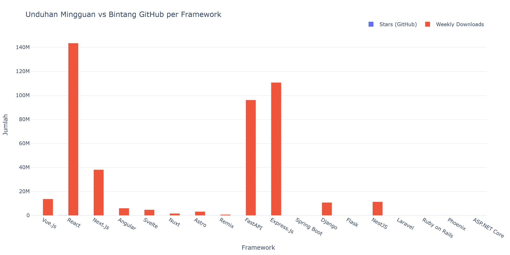
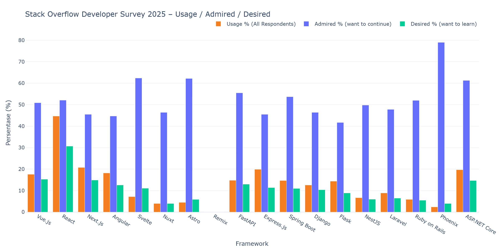
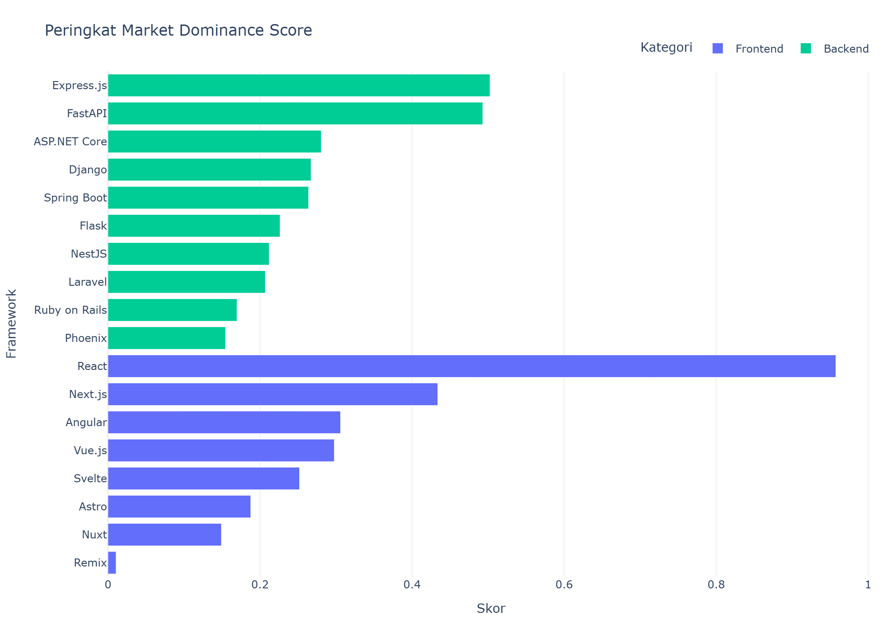

# Laporan Internal: Tren Framework 2026

**Tanggal Eksekusi:** 2026-06-16 15:00 UTC
**Sumber Data:** Github, Npm, Pypi, Stackoverflow

---

## Ringkasan Eksekutif

Berdasarkan analisis metrik GitHub (bintang, fork, issues) dan volume unduhan mingguan (NPM + PyPI) serta data Stack Overflow Developer Survey 2025 (usage, admired, desired), **React** menempati peringkat teratas dengan **Market Dominance Score 0.9574**. Framework ini menunjukkan dominasi kuat baik dari sisi popularitas komunitas maupun adopsi aktual di industri.

- **Frontend Leader:** React (skor 0.9574)
- **Backend Leader:** Express.js (skor 0.5026)

## Perbandingan Unduhan vs Bintang

Grafik batang di atas membandingkan jumlah bintang GitHub (biru) dengan volume unduhan mingguan (merah) untuk setiap framework. Perbedaan signifikan antara kedua metrik dapat mengindikasikan framework yang populer secara komunitas namun belum tentu paling banyak digunakan di production, atau sebaliknya.

## Stack Overflow Developer Survey 2025

Grafik ini menampilkan tiga metrik dari Stack Overflow Developer Survey 2025:

- **Usage %** – persentase responden yang menggunakan framework dalam setahun terakhir
- **Admired %** – persentase pengguna yang ingin terus menggunakannya
- **Desired %** – persentase non-pengguna yang ingin mempelajarinya

*Sumber: [Stack Overflow Developer Survey 2025](https://survey.stackoverflow.co/2025/technology), 23,678 responden, lisensi Open Database License (ODbL).*

| Framework | Usage % | Admired % | Desired % |
|-----------|--------:|----------:|----------:|
| React | 44.7% | 52.1% | 30.7% |
| Express.js | 19.9% | 45.5% | 11.4% |
| FastAPI | 14.8% | 55.5% | 13.0% |
| Next.js | 20.8% | 45.5% | 14.9% |
| Angular | 18.2% | 44.7% | 12.6% |
| Vue.js | 17.6% | 50.9% | 15.3% |
| ASP.NET Core | 19.7% | 61.3% | 14.7% |
| Django | 12.6% | 46.4% | 10.4% |
| Spring Boot | 14.7% | 53.7% | 11.0% |
| Svelte | 7.2% | 62.4% | 11.1% |
| Flask | 14.4% | 41.7% | 8.9% |
| NestJS | 6.7% | 49.8% | 6.0% |
| Laravel | 8.9% | 47.8% | 6.5% |
| Astro | 4.5% | 62.2% | 5.9% |
| Ruby on Rails | 5.9% | 52.0% | 5.5% |
| Phoenix | 2.4% | 79.0% | 4.0% |
| Nuxt | 4.0% | 46.4% | 4.0% |
| Remix | 0.0% | 0.0% | 0.0% |

## Peringkat Market Dominance Score

Skor komposit ini dihitung dengan formula gabungan: `Score = (norm_stars * 0.2) + (norm_downloads * 0.3) + (norm_so_usage * 0.25) + (norm_so_admired * 0.125) + (norm_so_desired * 0.125)`. Bobot terbagi seimbang antara data crawl (50%) dan survei Stack Overflow (50%).

## Tabel Peringkat Lengkap

| # | Framework | Kategori | Stars | Downloads | SO Usage% | Skor |
|---|-----------|----------|------:|----------:|----------:|-----:|
| 1 | React | Frontend | 245,923 | 143,595,274 | 44.7% | 0.9574 |
| 2 | Express.js | Backend | 69,190 | 110,798,455 | 19.9% | 0.5026 |
| 3 | FastAPI | Backend | 99,273 | 96,257,280 | 14.8% | 0.4930 |
| 4 | Next.js | Frontend | 140,065 | 38,202,756 | 20.8% | 0.4338 |
| 5 | Angular | Frontend | 100,370 | 6,082,279 | 18.2% | 0.3059 |
| 6 | Vue.js | Frontend | 53,839 | 13,791,694 | 17.6% | 0.2977 |
| 7 | ASP.NET Core | Backend | 38,049 | 0 | 19.7% | 0.2805 |
| 8 | Django | Backend | 87,884 | 10,860,760 | 12.6% | 0.2671 |
| 9 | Spring Boot | Backend | 80,946 | 0 | 14.7% | 0.2639 |
| 10 | Svelte | Frontend | 87,294 | 4,829,870 | 7.2% | 0.2520 |
| 11 | Flask | Backend | 71,669 | 0 | 14.4% | 0.2264 |
| 12 | NestJS | Backend | 75,863 | 11,447,061 | 6.7% | 0.2120 |
| 13 | Laravel | Backend | 84,489 | 0 | 8.9% | 0.2070 |
| 14 | Astro | Frontend | 60,210 | 3,267,248 | 4.5% | 0.1878 |
| 15 | Ruby on Rails | Backend | 58,691 | 0 | 5.9% | 0.1697 |
| 16 | Phoenix | Backend | 23,027 | 0 | 2.4% | 0.1547 |
| 17 | Nuxt | Frontend | 60,456 | 1,717,014 | 4.0% | 0.1492 |
| 18 | Remix | Frontend | 33,074 | 806,059 | 0.0% | 0.0107 |

## Analisis Arsitektur: Perbandingan Paradigma Framework

### Head-to-Head: React vs Next.js (Top 2 Frontend)

| Aspek | React (JSX) | Vue.js (SFC) | Svelte (Compiler) | Angular (Opinionated) |
|-------|-----------|----------------|------------------|--------------------|
| Paradigma | JSX (JavaScript-first) | Template + Script + Style | Compile-time reactivity | TypeScript DI + Decorator |
| State Mgmt | Hooks / Redux / Zustand | Composition API / Pinia | Stores / runes | Signals / NgRx |
| Learning Curve | Menengah–Tinggi | Rendah–Menengah | Rendah | Tinggi |
| Bundle Size | ~45KB + ReactDOM | ~40KB gzip | Paling ringan (compiler) | Besar (>100KB) |
| Enterprise Meta | Next.js | Nuxt | — | Built-in |

### Backend Paradigm Comparison

| Framework | Language | Paradigma | Async | Real-time |
|-----------|----------|-----------|-------|-----------|
| FastAPI | Python | Micro, async-first | ✅ Native | Via WebSockets |
| Express.js | JavaScript | Micro, minimalis | Via middleware | Socket.io |
| Spring Boot | Java | Opinionated, DI | Spring WebFlux | Spring WebSocket |
| Django | Python | Full-stack, batteries-included | Django Channels | Channels / Daphne |
| Flask | Python | Micro, fleksibel | Via extensions | Flask-SocketIO |
| NestJS | TypeScript | Modular, DI-heavy | ✅ Native | @nestjs/websockets |
| Laravel | PHP | Full-stack, elegant | Via Octane | Laravel Reverb |
| Ruby on Rails | Ruby | Convention over config | Via ActionCable | ActionCable |
| Phoenix | Elixir | Functional, BEAM VM | ✅ Native | Phoenix Channels |
| ASP.NET Core | C# | Enterprise, cross-platform | ✅ Kestrel | SignalR |

## Rekomendasi Teknis

Berdasarkan hasil analisis metrik dan karakteristik arsitektur masing-masing framework, berikut rekomendasi penggunaan berdasarkan spesifikasi tim:

| Spesifikasi Tim | Rekomendasi Frontend | Rekomendasi Backend | Alasan |
|-----------------|---------------------|--------------------:|--------|
| Tim kecil (2-5), MVP cepat | Vue.js / Svelte | FastAPI / Flask | Learning curve rendah, time-to-market tercepat |
| Tim menengah (5-15), SaaS | Next.js / Remix | Express.js / NestJS | SSR bawaan, ekosistem middleware luas |
| Enterprise besar (15+), long-term | Angular | Spring Boot / ASP.NET Core | Arsitektur opinionated, dukungan enterprise |
| Tim data/AI, integrasi ML | React | FastAPI | Ekosistem React untuk viz, async FastAPI untuk inference |
| Content/marketing site | Astro | Laravel / Django | Zero-JS performance, CMS-ready backend |
| Real-time / chat app | React / Vue.js | Phoenix / NestJS | Phoenix Channels / WebSocket native |
| Legacy migration | React / Nuxt | Django / Ruby on Rails | Batteries-included, rapid migration |
| Startup bootstrapping | Svelte / Astro | Laravel / Rails | Convention over config, fastest delivery |

---

*Laporan ini di-generate secara otomatis oleh Framework Trends Tracker pada 2026-06-16 15:00 UTC.*
