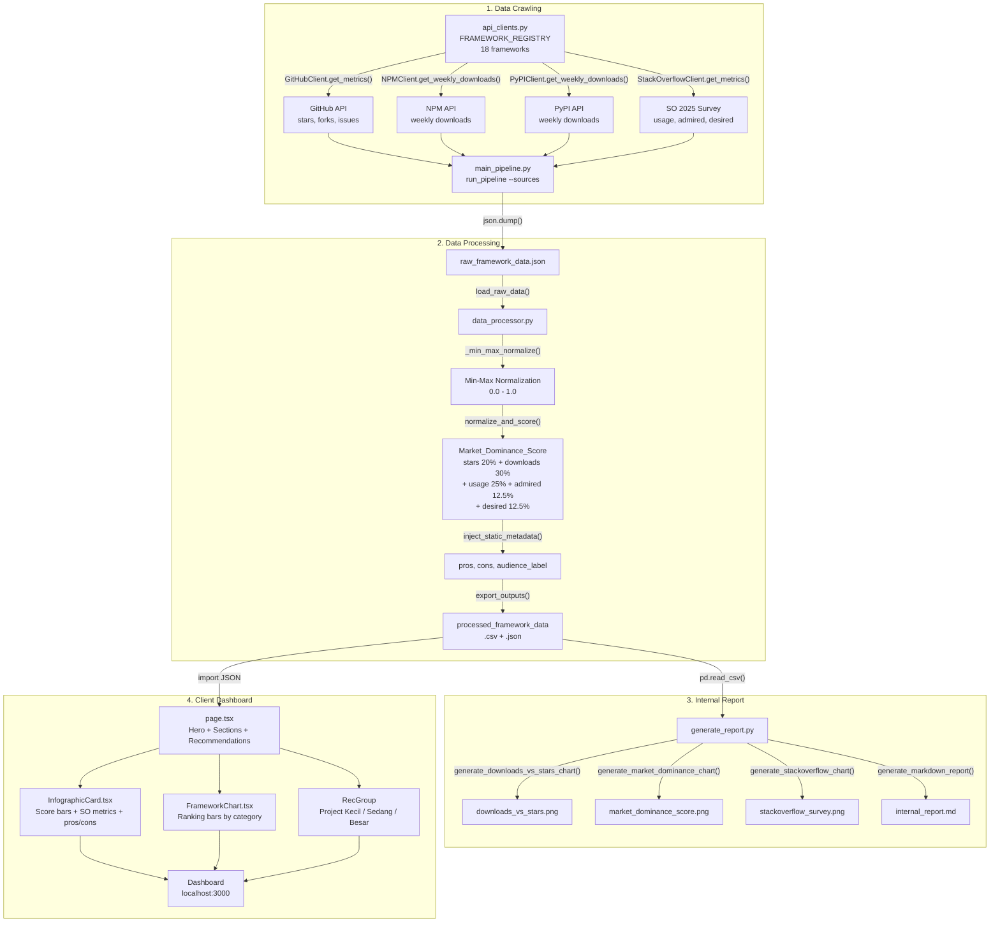

# Framework Trends Tracker — Pipeline Flow



## File Summary

| # | File | Function | Output |
|---|------|----------|--------|
| 1 | `scraper/api_clients.py` | Crawl GitHub, NPM, PyPI APIs | Raw metrics per framework |
| 2 | `scraper/stackoverflow_client.py` | SO 2025 survey data | Usage %, Admired %, Desired % |
| 3 | `scraper/main_pipeline.py` | Orchestrate all crawlers | `raw_framework_data.json` |
| 4 | `scraper/data_processor.py` | Normalize + score + metadata | `processed_framework_data.json` |
| 5 | `reports_internal/generate_report.py` | Plotly charts + markdown | 3 PNGs + `internal_report.md` |
| 6 | `client_dashboard/src/app/page.tsx` | Hero orbit + sections + recs | Interactive web page |
| 7 | `src/components/InfographicCard.tsx` | Framework card with bars | 18 cards (8 FE + 10 BE) |
| 8 | `src/components/FrameworkChart.tsx` | CSS ranking chart | Frontend vs Backend ranking |

## Scoring Formula (All Sources Combined)

```
Market_Dominance_Score =
  (norm_stars        × 0.20)  ← GitHub community interest
+ (norm_downloads    × 0.30)  ← NPM/PyPI production adoption
+ (norm_so_usage     × 0.25)  ← SO 2025 industry usage
+ (norm_so_admired   × 0.125) ← SO 2025 satisfaction
+ (norm_so_desired   × 0.125) ← SO 2025 growth potential
```

## 3 Scoring Modes

| Mode | Sources | Formula |
|------|---------|---------|
| **Combined** | All | Stars 20% + Downloads 30% + Usage 25% + Admired 12.5% + Desired 12.5% |
| **Crawl-only** | GitHub + NPM/PyPI | Stars 40% + Downloads 60% |
| **SO-only** | Stack Overflow | Usage 50% + Admired 25% + Desired 25% |
